# Questionário

## 1. Introdução

 &emsp;&emsp; Nesse segundo questionário os objetivos permanecem os mesmos, a diferença é que os envolvidos na pesquisa tinham contato direto com maratonas de progrmação. Todas as respostas do questionário foram de alunos ou ex-alunos que cursaram as disciplinas PPC e/ou TEP na FGA. Conseguimos menos resultados mas foram resultados mais centrados no usuário padrão do UVa.

## 2. Respostas Gráficas

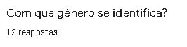

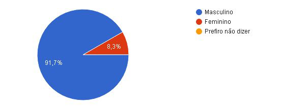

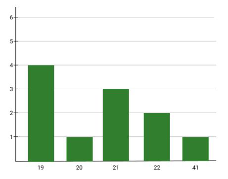

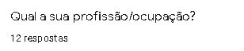

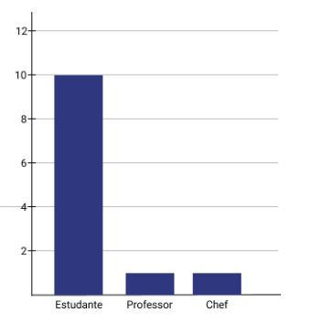

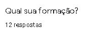

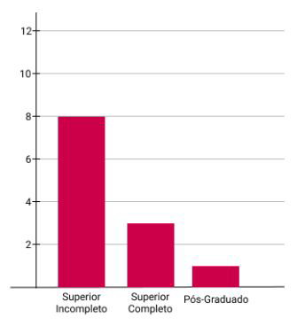

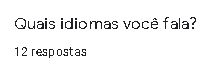

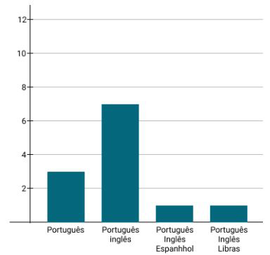

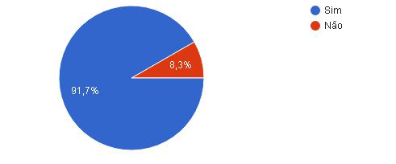

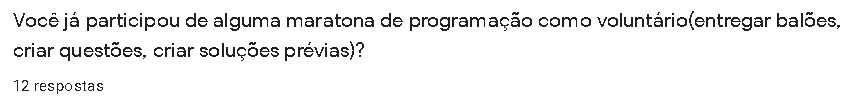

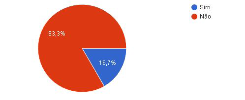

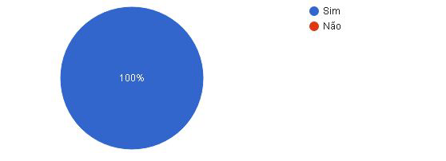

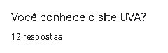

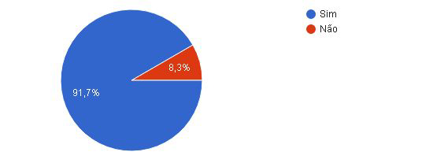

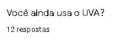

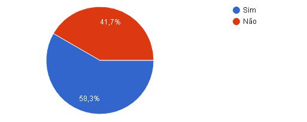

## 3. Versionamento

|Data|Versão|Descrição|Autor|
|:-:|:-:|:-:|:-:|
|17/10/2020|1.0|Criação das perguntas|Sérgio Cipriano|
|18/10/2020|1.1|Criação do questionário|Sérgio Cipriano e Washington Bispo|
|26/10/2020|1.2|Rearranjando tabelas|Sérgio Cipriano|
|28/10/2020|1.3|Trocando imagens do questionário|Washington Bispo|
